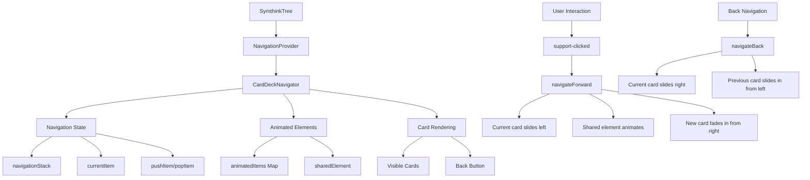

# My Shared Component

A shared React component library intended for both React Native (via react-native-web) and React Web projects.

## Installation

```bash
npm install my-shared-component
# or
yarn add my-shared-component
```

## Usage

```jsx
import React from 'react';
import { FullPageComponent, ThemeProvider } from 'my-shared-component';

const App = () => {
  return (
    <ThemeProvider initialTheme="light">
      <FullPageComponent title="My Awesome Component" />
    </ThemeProvider>
  );
};

export default App;
```

## Theming

The library supports two themes out of the box: `light` and `dark`. You can use the `useTheme` hook to access and toggle the current theme.

```jsx
import React from 'react';
import { useTheme } from 'my-shared-component';

const ThemeToggleButton = () => {
  const { theme, toggleTheme } = useTheme();
  
  return (
    <button onClick={toggleTheme}>
      Current theme: {theme}
    </button>
  );
};
```

## Components

- `FullPageComponent`: A full-page component that demonstrates the theme capabilities
- `SubComponentA`: A reusable sub-component
- `SubComponentB`: Another reusable sub-component

## SymthinkTree Navigation



## License

MIT 