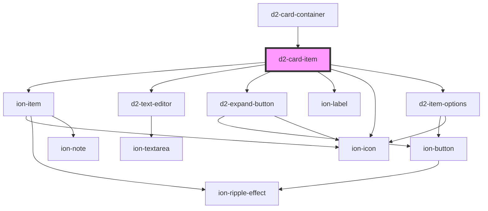

# d2-card-item

<!-- Auto Generated Below -->

## Properties

| Property        | Attribute  | Description | Type               | Default     |
| --------------- | ---------- | ----------- | ------------------ | ----------- |
| `canEdit`       | `can-edit` |             | `boolean`          | `false`     |
| `item`          | --         |             | `SymThink`         | `undefined` |
| `parentDoc`     | --         |             | `SymThinkDocument` | `undefined` |
| `sourceNumbers` | --         |             | `number[]`         | `[]`        |

## Events

| Event          | Description | Type                                                                  |
| -------------- | ----------- | --------------------------------------------------------------------- |
| `expandClick`  |             | `CustomEvent<{ item: SymThink; }>`                                    |
| `itemClick`    |             | `CustomEvent<{ item: SymThink; event: MouseEvent \| PointerEvent; }>` |
| `keyAction`    |             | `CustomEvent<{ key: string; type?: string; }>`                        |
| `optionsClick` |             | `CustomEvent<{ item: SymThink; event: MouseEvent \| PointerEvent; }>` |
| `textChange`   |             | `CustomEvent<{ item: SymThink; isModified: boolean; }>`               |

## Dependencies

### Used by

 - [d2-card-container](../d2-card-container)

### Depends on

- ion-item
- [d2-text-editor](../d2-text-editor)
- [d2-expand-button](../d2-expand-button)
- ion-label
- ion-icon
- [d2-item-options](../d2-item-options)

### Graph

----------------------------------------------

*Built with [StencilJS](https://stenciljs.com/)*
