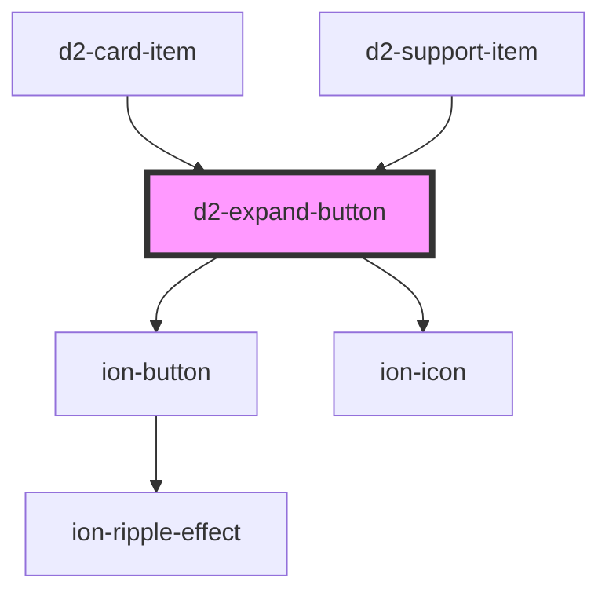

# d2-expand-button

<!-- Auto Generated Below -->

## Events

| Event         | Description | Type                |
| ------------- | ----------- | ------------------- |
| `expandClick` |             | `CustomEvent<void>` |

## Dependencies

### Used by

 - [d2-card-item](../d2-card-item)
 - [d2-support-item](../d2-support-item)

### Depends on

- ion-button
- ion-icon

### Graph

----------------------------------------------

*Built with [StencilJS](https://stenciljs.com/)*
