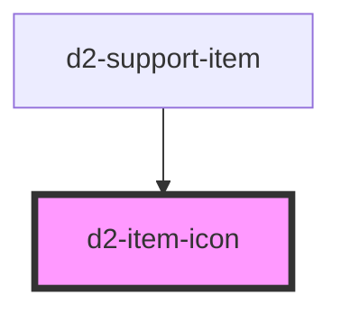

# d2-item-icon

<!-- Auto Generated Below -->

## Properties

| Property     | Attribute     | Description | Type      | Default |
| ------------ | ------------- | ----------- | --------- | ------- |
| `isEnabled`  | `is-enabled`  |             | `boolean` | `true`  |
| `isNumeric`  | `is-numeric`  |             | `boolean` | `false` |
| `itemNumber` | `item-number` |             | `number`  | `0`     |

## Dependencies

### Used by

 - [d2-support-item](../d2-support-item)

### Graph

----------------------------------------------

*Built with [StencilJS](https://stenciljs.com/)*
