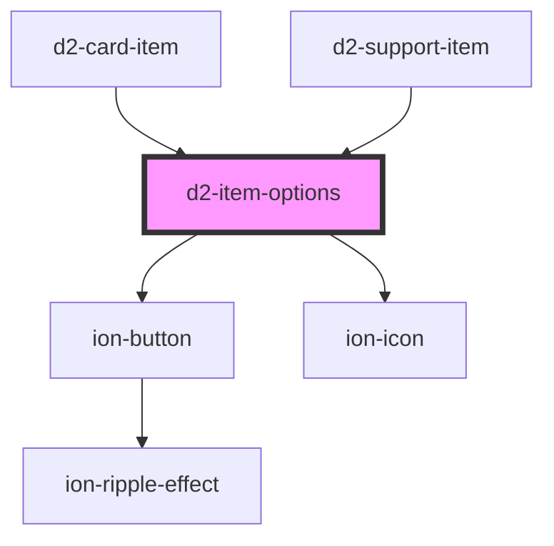

# d2-item-options

<!-- Auto Generated Below -->

## Properties

| Property | Attribute | Description | Type       | Default     |
| -------- | --------- | ----------- | ---------- | ----------- |
| `item`   | --        |             | `SymThink` | `undefined` |

## Events

| Event          | Description | Type                                                                  |
| -------------- | ----------- | --------------------------------------------------------------------- |
| `optionsClick` |             | `CustomEvent<{ item: SymThink; event: MouseEvent \| PointerEvent; }>` |

## Dependencies

### Used by

 - [d2-card-item](../d2-card-item)
 - [d2-support-item](../d2-support-item)

### Depends on

- ion-button
- ion-icon

### Graph

----------------------------------------------

*Built with [StencilJS](https://stenciljs.com/)*
