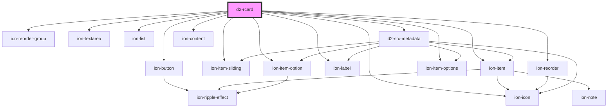

# d2-rcard

<!-- Auto Generated Below -->

## Properties

| Property  | Attribute  | Description                                                                                           | Type                           | Default     |
| --------- | ---------- | ----------------------------------------------------------------------------------------------------- | ------------------------------ | ----------- |
| `canEdit` | `can-edit` |                                                                                                       | `boolean`                      | `false`     |
| `data`    | --         | Cannot pass this via html attribute. Data must be an object reference, so pass via JSX or Javascript. | `SymThink \| SymThinkDocument` | `undefined` |
| `domrect` | --         |                                                                                                       | `DOMRect`                      | `undefined` |
| `notify`  | --         |                                                                                                       | `Subject<string>`              | `undefined` |

## Events

| Event        | Description | Type                                                                                                      |
| ------------ | ----------- | --------------------------------------------------------------------------------------------------------- |
| `docAction`  |             | `CustomEvent<{ action: any; value: any; }>`                                                               |
| `itemAction` |             | `CustomEvent<{ action: any; value: any; domrect?: DOMRect; pointerEvent?: MouseEvent \| PointerEvent; }>` |

## Dependencies

### Depends on

- ion-button
- ion-icon
- ion-reorder-group
- ion-item-sliding
- ion-item
- ion-textarea
- ion-label
- ion-reorder
- ion-item-options
- ion-item-option
- ion-list
- [d2-src-metadata](../d2-src-metadata)
- ion-content

### Graph

----------------------------------------------

*Built with [StencilJS](https://stenciljs.com/)*
