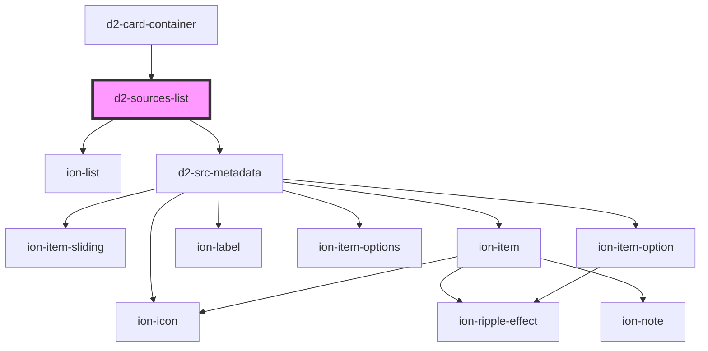

# d2-sources-list

<!-- Auto Generated Below -->

## Properties

| Property     | Attribute  | Description | Type                                                       | Default |
| ------------ | ---------- | ----------- | ---------------------------------------------------------- | ------- |
| `canEdit`    | `can-edit` |             | `boolean`                                                  | `false` |
| `sourceList` | --         |             | `{ id: string; index: number; src: CitationStyleLang; }[]` | `[]`    |

## Dependencies

### Used by

 - [d2-card-container](../d2-card-container)

### Depends on

- ion-list
- [d2-src-metadata](../d2-src-metadata)

### Graph

----------------------------------------------

*Built with [StencilJS](https://stenciljs.com/)*
