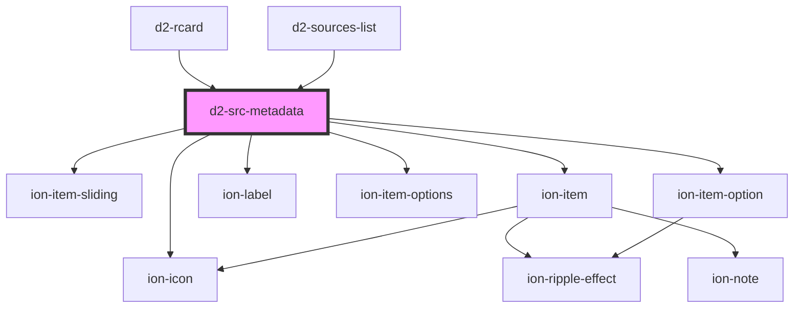

# d2-src-metadata

<!-- Auto Generated Below -->

## Properties

| Property  | Attribute  | Description | Type                                                                                                                                                                                                                        | Default     |
| --------- | ---------- | ----------- | --------------------------------------------------------------------------------------------------------------------------------------------------------------------------------------------------------------------------- | ----------- |
| `canEdit` | `can-edit` |             | `boolean`                                                                                                                                                                                                                   | `false`     |
| `data`    | --         |             | `{ type?: string; title?: string; author?: { family: string; given?: string; }[]; issued?: { "date-parts": [[number, number, number]]; }; "container-title"?: string; publisher?: string; URL?: string; source?: string; }` | `undefined` |
| `index`   | `index`    |             | `number`                                                                                                                                                                                                                    | `undefined` |
| `listNo`  | `list-no`  |             | `number`                                                                                                                                                                                                                    | `undefined` |
| `stid`    | `stid`     |             | `string`                                                                                                                                                                                                                    | `undefined` |

## Events

| Event        | Description | Type                                        |
| ------------ | ----------- | ------------------------------------------- |
| `itemAction` |             | `CustomEvent<{ action: any; value: any; }>` |

## Dependencies

### Used by

 - [d2-rcard](../d2-rcard)
 - [d2-sources-list](../d2-sources-list)

### Depends on

- ion-item-sliding
- ion-item
- ion-label
- ion-item-options
- ion-item-option
- ion-icon

### Graph

----------------------------------------------

*Built with [StencilJS](https://stenciljs.com/)*
