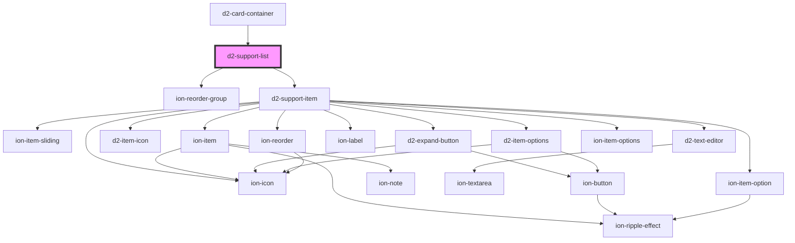

# d2-support-list

<!-- Auto Generated Below -->

## Properties

| Property    | Attribute  | Description | Type                                         | Default     |
| ----------- | ---------- | ----------- | -------------------------------------------- | ----------- |
| `canEdit`   | `can-edit` |             | `boolean`                                    | `false`     |
| `data`      | --         |             | `SymThink`                                   | `undefined` |
| `parentDoc` | --         |             | `SymThinkDocument`                           | `undefined` |
| `sourcList` | --         |             | `{ id: string; index: number; src: any; }[]` | `[]`        |

## Events

| Event          | Description | Type                                                                                     |
| -------------- | ----------- | ---------------------------------------------------------------------------------------- |
| `expandClick`  |             | `CustomEvent<{ item: SymThink; }>`                                                       |
| `extendClick`  |             | `CustomEvent<{ item: SymThink; }>`                                                       |
| `itemClick`    |             | `CustomEvent<{ item: SymThink; event: MouseEvent \| PointerEvent; domrect?: DOMRect; }>` |
| `keyAction`    |             | `CustomEvent<{ key: string; type?: string; }>`                                           |
| `optionsClick` |             | `CustomEvent<{ item: SymThink; event: MouseEvent \| PointerEvent; }>`                    |
| `removeClick`  |             | `CustomEvent<{ item: SymThink; }>`                                                       |
| `reorderItems` |             | `CustomEvent<any>`                                                                       |
| `textChange`   |             | `CustomEvent<{ item: SymThink; isModified: boolean; }>`                                  |

## Dependencies

### Used by

 - [d2-card-container](../d2-card-container)

### Depends on

- ion-reorder-group
- [d2-support-item](../d2-support-item)

### Graph

----------------------------------------------

*Built with [StencilJS](https://stenciljs.com/)*
