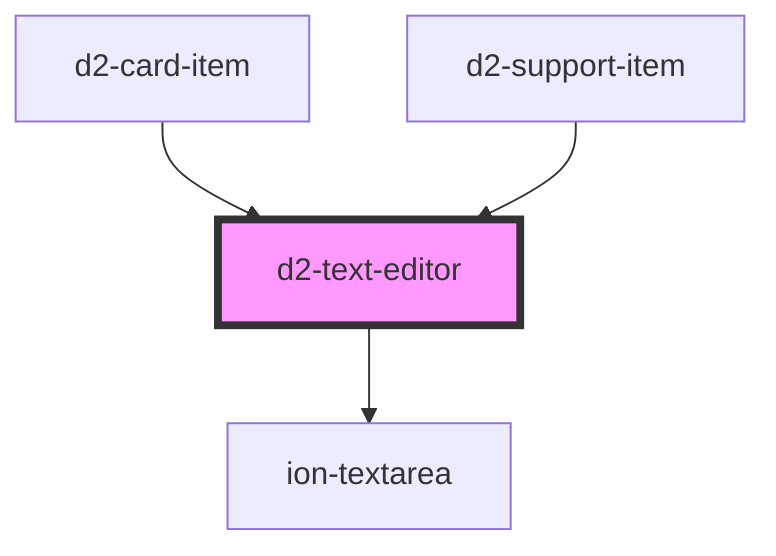

# d2-text-editor

<!-- Auto Generated Below -->

## Properties

| Property      | Attribute     | Description | Type       | Default     |
| ------------- | ------------- | ----------- | ---------- | ----------- |
| `height`      | `height`      |             | `number`   | `50`        |
| `isTopItem`   | `is-top-item` |             | `boolean`  | `false`     |
| `item`        | --            |             | `SymThink` | `undefined` |
| `placeholder` | `placeholder` |             | `string`   | `''`        |

## Events

| Event        | Description | Type                                                    |
| ------------ | ----------- | ------------------------------------------------------- |
| `keyAction`  |             | `CustomEvent<{ key: string; type?: string; }>`          |
| `textChange` |             | `CustomEvent<{ item: SymThink; isModified: boolean; }>` |

## Methods

### `focus() => Promise<void>`

#### Returns

Type: `Promise<void>`

## Dependencies

### Used by

 - [d2-card-item](../d2-card-item)
 - [d2-support-item](../d2-support-item)

### Depends on

- ion-textarea

### Graph

----------------------------------------------

*Built with [StencilJS](https://stenciljs.com/)*
